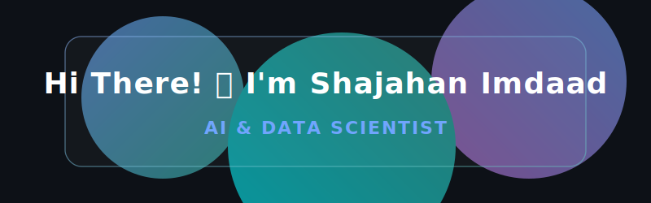
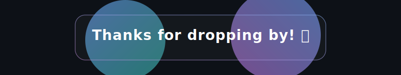

<!-- Header -->

  

 

  

 

<!-- Portfolio Button and Socials -->

  
  <!-- Replace href with your actual LinkedIn URL -->
  
  <!-- Replace href with your actual email -->
  

 

## 🐍 GitHub Contribution Snake

  <picture>
    <source media="(prefers-color-scheme: dark)" srcset="https://raw.githubusercontent.com/ShajahanImdaad53/ShajahanImdaad53/output/dist/github-contribution-grid-snake-dark.svg">
    <source media="(prefers-color-scheme: light)" srcset="https://raw.githubusercontent.com/ShajahanImdaad53/ShajahanImdaad53/output/dist/github-contribution-grid-snake.svg">
    
  </picture>

 

## 📈 GitHub Activity Graph

  

## 📊 GitHub Statistics

  
  

 

  

## 💻 Tech Stack & Tools

  

    
  

 

<!-- Footer -->

  

